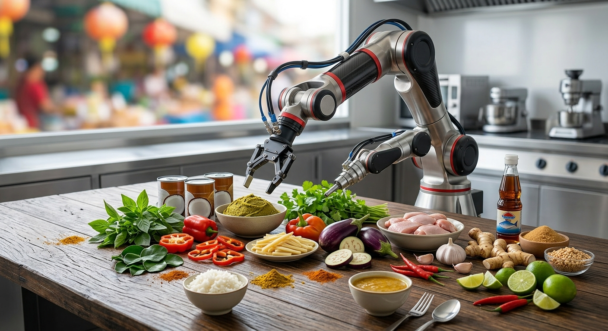
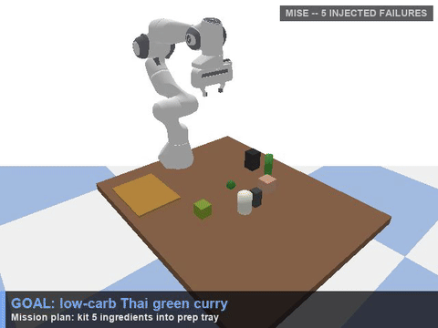

# Mise

**A long-horizon physical agent.** Tell it what to cook. It plans the mission, kits the ingredients with a robot arm — and when something physically goes wrong mid-run, it notices, diagnoses, and recovers.

Built for the **AGI House Hackathon — Long-Horizon Agents**.
**[Live demo page →](https://bouncypitch.github.io/mise/)**


---

## The problem

> "An agent that succeeds at each step 99% of the time still fails a 100-step task more often than not."
> — AGI House, *Long-Horizon Agents: A Technical Primer*

Most agent demos only show the happy path — one clean trajectory, no visible recovery. Mise deliberately seeds real, deterministic physical failures and demonstrates detection + recovery mid-run, live, in a physics simulator.

This is **not** "an LLM controls a robot." The LLM never touches trajectories, joint angles, or PyBullet calls — it only interprets goals, diagnoses failures, and replans.



*The mission — kit every raw ingredient into the tray.*

## Demo

| Clean run | Stress test |
|---|---|
| [](media/mise_demo_clean.mp4) | [](media/mise_demo_failures.mp4) |
| 5/5 kitted · 0 failures · hazard rate 0.0 | 5/5 kitted despite 5 injected failures · hazard rate 0.333 |

GIF previews above (click either to download the full-quality `.mp4`) — or watch both with audio-free native playback on the **[live demo page](https://bouncypitch.github.io/mise/)**.

## How it thinks

```
GOAL → PLAN → ACT → OBSERVE → VERIFY
                                 │
                          on failure
                                 ▼
                  DIAGNOSE → REPLAN → ACT AGAIN
```

**Hard boundary:** the LLM only does goal interpretation, mission decomposition, failure diagnosis, and replanning — it outputs named parameters (an object, a strategy enum, an offset), never joint angles or PyBullet calls. All IK, motion, grasp execution, and verification are deterministic Python — the same code path every run.

### How does it recognize failure

`verifier.py` is deterministic with zero LLM involvement. After every action it independently re-derives success from the observed physics state — it never trusts what the controller claims happened:

```python
def verify_pick(name, ee_pos, obj_pos, table_top_z):
    gripper_ok = dist(ee_pos, obj_pos) < 0.06   # is it actually near the gripper?
    lifted_ok  = obj_pos[2] > table_top_z + 0.05  # is it actually off the table?
    return gripper_ok and lifted_ok
```

Every result is also checked against the **world model** (`world_model.py`) — a plain, checkpointed JSON record of what should be true for each object (location, status, attempt count). A mismatch is logged as expected-vs-observed and written to disk immediately, so the mission state survives a crash even though this build doesn't exercise an actual resume.

### How does it recover

A missed grasp on `basil` is diagnosed as **behavioral drift** — right object, right timing, wrong execution. The planner (`llm_planner.py`) swaps in a genuinely different strategy — a lower, rotated side-grasp — not a blind retry of the same motion:

```
DIAGNOSE DRIFT → PICK NEW STRATEGY → REPLAN → ACT AGAIN
```

Grasp success itself is a **controller decision, not a physics outcome**: a successful pick attaches the object via a fixed constraint rather than relying on friction, so it's 100% reproducible across runs. Failure injection follows a fixed schedule, not randomness — success and failure walk the same code path, differing only in strategy parameters.

## Results

| Metric | 0 failures | 1 failure (seeded) | 5 failures (stress) |
|---|---|---|---|
| Ingredients kitted | 5/5 | 5/5 | 5/5 |
| Actions taken | 10 | 11 | 15 |
| Failed attempts | 0 | 1 | 5 |
| Replans | 0 | 1 | 5 |
| Hazard rate | 0.0 | 0.091 | 0.333 |
| Mission status | VERIFIED | VERIFIED | VERIFIED |

Mission completion is unaffected by injected-failure count — every seeded drift event is independently diagnosed, replanned with a genuinely different strategy, and recovered before the mission derails. The full three-level evaluation (outcome / trajectory / component) prints after every run and is mirrored to `checkpoints/state_checkpoint.json`.

## The bigger vision

```
VOICE → DECOMPOSE → RETRIEVE → [ KIT ] → PREP → COOK
                                  ▲
                            this hackathon
```

A voice request is decomposed into an ingredient list, a robot retrieves each raw ingredient, kits them into a tray, then cuts and preps them so they're ready to cook. **Kitting is the piece we built** — it's a repeatable task across industries (meal kits, hospitals, warehouses, manufacturing), which made it the right scope for a hackathon: narrow enough to get right, general enough to matter.

## Quickstart

```bash
git clone https://github.com/bouncypitch/mise.git
cd mise
python -m venv .venv && source .venv/bin/activate   # or use conda
pip install -r requirements.txt

python main.py "I want a low-carb Thai green curry"
```

A live dashboard starts automatically at **http://127.0.0.1:5050**, showing the sim view, mission checklist, and event log in real time. Add `--no-ui` to skip it, or `--fast` to skip the pacing delay between steps.

## Project structure

```
main.py              mission loop: GOAL → PLAN → ACT → OBSERVE → VERIFY → DIAGNOSE → REPLAN
sim_env.py            PyBullet scene: robot, table, tray, ingredients
robot_controller.py   deterministic IK, motion, and grasp execution
verifier.py            zero-LLM, geometry-based success/failure checks
world_model.py         explicit, checkpointed mission state (not conversation history)
llm_planner.py          goal interpretation, failure diagnosis, replanning (mock by default)
ui_server.py / dashboard.html   live Flask dashboard
index.html              this project as a single-page site
Mise_Pitch_Deck_minimal.pptx    hackathon pitch deck
media/                  recorded demo videos
checkpoints/             sim snapshots, generated images, run checkpoints
```

## Tech stack

- **Simulation:** PyBullet
- **Planning:** deterministic mock planner by default (no API key required); a guarded seam exists for a real Anthropic call, inactive unless `ANTHROPIC_API_KEY` is set, with automatic fallback on any error
- **Dashboard:** Flask, polling ~300ms, single-writer/many-reader (no locks needed at this scale)
- **Language:** Python 3.10+

## Capability tier

**H1 (intra-context)** with H2-flavored architecture — many coupled steps within a single context window, requiring reasoning that verifies and recovers before the chain derails. World state is externalized, checkpointed JSON rather than conversation history, which is the H2-flavored piece; this build doesn't exercise an actual crash/resume.

---

Built for the AGI House Long-Horizon Agents hackathon.
